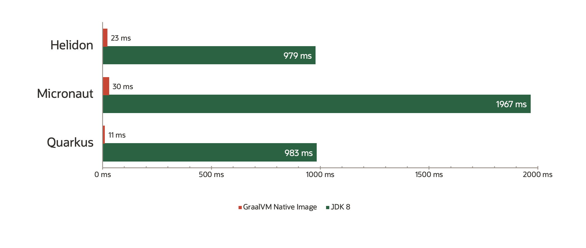

# 00: What is Native Image

A very simple, and short, descripton of what Native Image might be:

- A new way of thinking about building Java applications that has both:
    - A Build Time phase and
    - A Run Time phase
- A way of building native executables from Java applications
    - Java Application => Native Image Tool => exe
- A way to reduce the start-up time & Memory Consumption of your Java Applications

## Benefits - Runtime Advantages
   
Followng on from the previous incredibly short ouline of what Native Image is, we can see that this tool has some very 
important benefits for anyone running writing and building Java applications:

### Memory: 

GraalVM Native Image allows you to reduce the memory consumption of your Java applications

Memory usage can be a significant cost when runnign large applications. If you can reduce the memory footprint
of applications, then you can also reduce the cost.

### Startup Time:

GraalVM Native Image allows for near instantaneous start time times for Java micro-service applications

Fast start-up times opens the path to zero scaling parts of your application / micro-services. If an application can start
within 10s of milliseconds, could you not actually run it until you need it? Whether this woks for you will obviously
depend on the SLAs that you have & on the application.

### Reduction in Package Size:

Packaging applications as Native Images significantly reduces the size of the resultant app / containers. We can also 
use tools, such as `upx` to compress the native image even more. In this workshop we will take a look at how much we 
are able to reduce the packaged size of a Java micro-service by using Native Image & `upx`.

### Security:

There is less in a packaged Native Image and therefore less of an attack surface. We believe that this leads to improved 
security.

## Things to be Aware of

Be aware, though, that Native Image is a different technology from the JVM. The benefits that native image offers, in 
part arise from some of the assumptions that it is built on and it is important to understand these, If you stick to 
building new apps using a framework that is designed to target Native Image, you will not often hit issues, though you 
may still do if you import a Java library that doesn't play well with Native Image. This is where it is important to 
understand what is happening inside.

A very rough overview of some of the limitations of Native Image are listed 
[here : Natve Image Limitations & Unsupported Features](./native-image-limitations.md).

Most limitations can be worked around and this is something that we will see as we step through the various parts of 
this workshop.

## Want to use Native Image? Use a Framework

Use a framework, as these are designed to ease the path. If you choose a framework that is designed to work with Native 
Image then the process will be easier, but that is not to say that you can't port existing applications. You can, but you 
may need to be more aware of how Native Image works.

The following frameworks are all designed to support Native Image as a target for execution:

- [Micronaut](https://micronaut.io/)
- [Helidon](https://helidon.io/#/)
- [Spring Boot](https://github.com/spring-projects-experimental/spring-graalvm-native)
- [Picocli](https://picocli.info/)
- [Quarkus](https://quarkus.io/)

---

