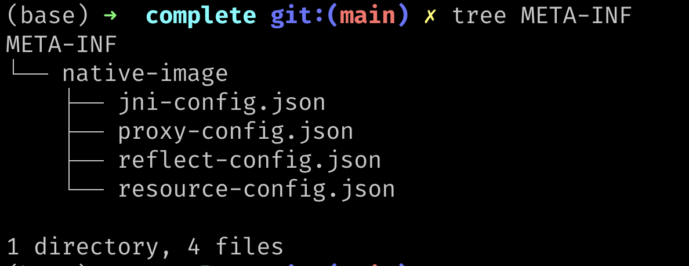

# 02 : Assisted Configuration for GraalVM Native Image

<div class="inline-container">

<strong>
  Estimated time: 10 minutes
</strong>
</div>

<div class="inline-container">

<strong>
References:
</strong>
</div>

- [Native Image : Class Initialization](https://www.graalvm.org/reference-manual/native-image/ClassInitialization/)

## The Closed World Assumption

GraalVM native image build uses the closed universe assumption, which means that all the bytecode in the application 
needs to be known (observed and analysed) at the build time.

One area the analysis process is responsible for is to determine which classes, methods and fields need to be included 
in the executable. The analysis is static, it can't know about any dynamic class loading, reflection etc., so it needs 
some configuration to correctly include the parts of the program that use dynamic features of the language.

What can information can we pass to the native image build?

* _Reflection_
* _Resources_
* _JNI_
* _Dynamic Proxies_

For example, classes and methods accessed through the Reflection API need to be configured. There are a few ways how 
these can be configured, but the most convenient way is the assisted configuration javaagent.

## An Example

Imagine you have a class like this in the `ReflectionExample.java`:


```java
import java.lang.reflect.Method;

class StringReverser {
    static String reverse(String input) {
        return new StringBuilder(input).reverse().toString();
    }
}

class StringCapitalizer {
    static String capitalize(String input) {
        return input.toUpperCase();
    }
}

public class ReflectionExample {
    public static void main(String[] args) throws ReflectiveOperationException {
        String className = args[0];
        String methodName = args[1];
        String input = args[2];

        Class<?> clazz = Class.forName(className);
        Method method = clazz.getDeclaredMethod(methodName, String.class);
        Object result = method.invoke(null, input);
        System.out.println(result);
    }
}
```

First, let's build it:


```bash
javac ReflectionExample.java
```

The main method invokes all methods whose names are passed in as command line arguments.
Run it normally and explore the output.


```bash
java ReflectionExample StringReverser reverse "hello"
```

As expected, the method `foo` was found via reflection, but the non-existent method `xyz` was not found.

Let's build a native image out of it:


```bash
native-image --no-fallback ReflectionExample
```

*If you're interested ask the workshop leaders about the `--no-fallback` option*

Run the result and explore the output:


```bash
./reflectionexample StringReverser reverse "hello"

Exception in thread "main" java.lang.ClassNotFoundException: StringReverser
	at com.oracle.svm.core.hub.ClassForNameSupport.forName(ClassForNameSupport.java:60)
	at java.lang.Class.forName(DynamicHub.java:1214)
	at ReflectionExample.main(ReflectionExample.java:21)
```


## Native Image, Assisted Configuration : Enter The Java Agent

Writing a complete reflection configuration file from scratch is possible, but tedious. Therefore, we provide an agent 
for the Java HotSpot VM.

We can use the tracing agent when running the Java application and let it record all of this config for us.

First, we create the directory for the configuration to be saved to:


```bash
mkdir -p META-INF/native-image
```

Then, we run the application with the tracing agent enabled:


```bash
# Note: the tracing agent must come before classpath and jar params on the command ine
java -agentlib:native-image-agent=config-output-dir=META-INF/native-image ReflectionExample StringReverser reverse "hello"
```



Explore the created configuration:


```bash
cat META-INF/native-image/reflect-config.json
```


```json
[
    {
    "name":"StringReverser",
    "methods":[{"name":"reverse","parameterTypes":["java.lang.String"] }]
    }
]
```

You can do this mutiple times and the runs are merged if we specify `native-image-agent=config-merge-dir`:


```bash
java -agentlib:native-image-agent=config-merge-dir=META-INF/native-image ReflectionExample StringCapitalizer capitalize "hello"
```

Building the native image now will make use of the provided configuration and configure the reflection for it.


```bash
native-image --no-fallback ReflectionExample
```

Now let's see if that works any better:


```bash
./reflectionexample StringReverser reverse "joker"
```

This is a very convenient & easy way to configure reflection and resources used by the application for building native images.

Some things to bear in mind when using the tracing agent:

* Use your test suites. You need to exercise as many paths in your code as you can
* You may need to review & edit your config files

Next, we'll try to explore some more options how to configure the class initialization strategy for native images.

---
<a href="../3/">
    
</a>

